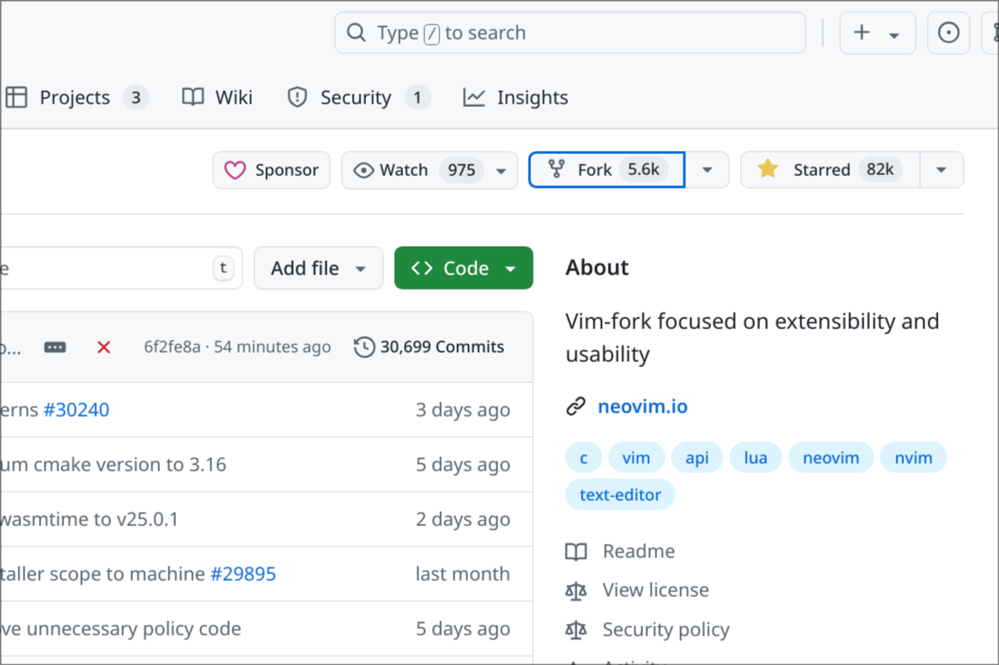

## NIL 文档站

本仓库暂用于 NIL 文档存储。

目前仍在早期开发阶段，所以还不完善，见谅。

## 构建

推荐使用 python 内置的 venv 或者其他的第三方工具建一个虚拟环境

```bash
$ git clone --depth=1 https://github.com/suoyuan666/NIL_notes
$ cd NIL_notes && python -m venv .
$ source ./bin/activate
$ pip install mkdocs-material mkdocs
```

> [!NOTE]
>
> 如果你使用的是 python 3.13，请使用 `python -m venv . --without-scm-ignore-files` 而不是 `python -m venv .`
>
> 根据 [Creating virtual environments](https://docs.python.org/3/library/venv.html#creating-virtual-environments)，python 3.13 后，venv 默认在根目录生成一个 **.gitignore**，添加了 `--without-scm-ignore-files` 选项用于关闭这个功能。
>
> 如果你不知道你电脑安装的 python 的版本，使用 `python --version` 会打印出版本信息

##  如何参与维护

在 GitHub 上 fork 该仓库，之后将你 fork 后产生的仓库 clone 到本地



蓝框的这个就是 fork。

之后你的账户下就有了这个仓库，之后在一个你认为合适的文件夹内运行下边这个命令

```bash
$ git clone https://github.com/suoyuan666/NIL_notes
```

> [!NOTE]
>
> 该命令会导致你当前的目录多出一个名为 *NIL_notes* 的目录，请选择一个合适的位置。
>
> 把这里的 *suoyuan666* 换成你的用户名，也就是说这个链接是你 fork 之后，你账户下的仓库的链接。

该文档使用 [mkdocs](https://github.com/mkdocs/mkdocs) 生成，使用了 [mkdocs-material](https://github.com/squidfunk/mkdocs-material) 主题，所以需要使用 pip 安装相关的库。

我推荐使用虚拟环境安装相关的库文件，这样安装的库文件不会污染到整个系统中。Python 内置了一个虚拟环境的模块 [venv](https://docs.python.org/zh-cn/3/library/venv.html)，也有第三方的工具实现更好的虚拟环境，我印象中有一个可以允许虚拟环境指定 Python 版本的，但我没用过。

在你 clone 后的目录下运行:

```bash
$ python -m venv .
$ source ./bin/activate
```

> [!NOTE]
>
> 如果你使用的是 python 3.13，请使用 `python -m venv . --without-scm-ignore-files` 而不是 `python -m venv .`
>
> 根据 [Creating virtual environments](https://docs.python.org/3/library/venv.html#creating-virtual-environments)，python 3.13 后，venv 默认在根目录生成一个 **.gitignore**，添加了 `--without-scm-ignore-files` 选项用于关闭这个功能。
>
> 如果你不知道你电脑安装的 python 的版本，使用 `python --version` 会打印出版本信息

第一个命令是将该目录初始化成一个虚拟环境中的根目录（也就是虚拟环境下的库文件都会安装到这里），由于存在 **.gitignore**，所以你在提交代码的时候不会把他们提交上去，如果你不想在当前目录初始化也可以，随便找个位置，不过第二条的 `.` 也得变成你自己定义的目录。

第二个命令是为了将当前的环境变成你初始化好的虚拟环境，[venv](https://docs.python.org/zh-cn/3/library/venv.html#how-venvs-work) 中列出了不同 shell 需要执行的命令。如果你使用的是 `bash/zsh` 那就执行我给出的这个命令就行了。

之后使用 `pip` 安装相关库文件

```bash
$ pip install mkdocs-material mkdocs
```

如果因为网络原因无法正常下载库文件，可以使用国内的 pypi 源，这样就是向国内的服务器访问，会快很多。

给出以下的镜像源:

- [pypi | Tsinghua Open Source Mirror](https://mirrors.tuna.tsinghua.edu.cn/help/pypi/)
- [PyPI - USTC Mirror Help](https://mirrors.ustc.edu.cn/help/pypi.html)
- [PyPI — NJU Mirror Help](https://nju-mirror-help.njuer.org/pypi.html)

此外还有上交大，北京外国语等学校都提供了镜像源服务，不过不清楚是否提供了 pip 的镜像源，除此之外，阿里，腾讯等也提供了镜像源服务。

清华和南大的镜像源甚至提供了常见软件安装包和 Linux 发行版的系统镜像文件，可以直接在镜像站中下载。我并不清楚中科大的镜像站是否也提供了这个服务。

该项目的基本结构:

```txt
.
├── bin
│   ├── activate
│   ├── activate.csh
│   ├── activate.fish
│   ├── Activate.ps1
│   ├── ghp-import
│   ├── markdown_py
│   ├── mkdocs
│   ├── mkdocs-get-deps
│   ├── normalizer
│   ├── pip
│   ├── pip3
│   ├── pip3.12
│   ├── pybabel
│   ├── pygmentize
│   ├── python -> /usr/lib/python-exec/python3.12/python
│   ├── python3 -> python
│   ├── python3.12 -> python
│   └── watchmedo
├── include
│   └── python3.12
├── lib
│   └── python3.12
│       └── site-packages
├── lib64 -> lib
├── pyvenv.cfg
├── README.md
└── src
    ├── docs
    │   ├── index.md
    │   ├── linux/
    │   ├── notes/
    │   ├── programming/
    │   └── tools/
    └── mkdocs.yml
```

_bin_, _lib_, _lib64_ 等就是 python 的 venv 自动生成的，_src_ 存档了文档的配置文件和源文件等。

`mkdocs` 需要一个配置文件，这里的就是 _src/mkdocs.yml_，你可以在 _src_ 目录下执行 `mkdocs serve` 即可在你的浏览器中本地访问。

配置文件这里只说 `nav` 部分，其他的可以参考 [Configuration](https://www.mkdocs.org/user-guide/configuration/)

```yml
nav:
  - 开始:
    - index.md
  - 编程基础:
    - C/C++:
      - programming/lec00/lec00.md
  - Linux 相关:
    - linux/keep.md
  - 工具使用:
    - tools/keep.md
  - 笔记:
    - notes/keep.md
```

这里表示的就是文档的层级关系，你简单看一下网页就能知道这到底是什么写的了。你可以在 _src/docs_ 文件夹中找到对应的文件。

文档使用 Markdown 语言编写，如果不熟悉可参考 [Markdown](./misc/markdown/)

修改玩之后可以在 *src* 路径下执行 `mkdocs serve` 查看修改后的网页。

如果你的修改结束，可以使用 `git` 添加你的修改，你可以:

```bash
$ git add /path/to/afile /path/to/bfile
$ git add .
$ git add -p .
```

- 第一个是指定文件添加到本次的修改中
- 第二个是将当前目录所有修改的文件都添加到本次的修改，会递归遍历子目录
- 第三个是找到当前所有修改的文件并依次询问你是否要将该文件添加到本次的修改，不会递归遍历子目录

之后要为本次的修改正式起一个名字

```bash
$ git commit -m "title"
$ git commit
```

- 第一个是将 `title` 作为本次提交所附带的信息
- 第二个会打开终端默认的编辑器，你可以在上面编辑本次提交附带的信息

commit 之后就可以 push 到你的仓库中了

```bash
$ git push
```

这里有一个问题，GitHub 默认需要你生成一个 key 去验证是你本人提交（虽然这不代表本次提交是签名的）

在 GitHub 设置中的 **Developer Settings** -> Personal access tokens 有两个选项，第一个细粒度可以对单独仓库生成 token，第二个则不是，无论如何你至少需要 repo 的写权限。

生成好了之后，用户名是你注册时的 username，而密码就是生成的 token 了

> [!NOTE]
>
> token 只会在生成的时候提供给你，请将它妥善保管

push 了之后你会发现你的仓库会有一个将你的修改请求同步到上游的申请，点击就到了 pull request 的请求界面