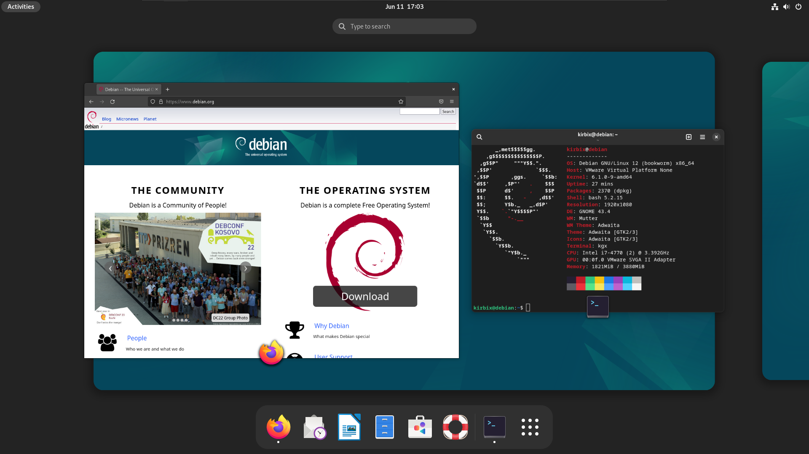

## Linux 发行版介绍

Linux 只是一个单独的操作系统内核，并非是我们日常使用的操作系统全部，Linux 没有图形化的界面，文本编辑器，浏览器等软件。一些组织将 Linux 和其他软件结合到一起发行，将上游的应用打包提供给用户，这就是这些 Linux 发行版所在做的事。

[FabioLolix/LinuxTimeline](https://github.com/FabioLolix/LinuxTimeline) 介绍了很多 Linux 发行版的时间线

### Debian 相关

首先介绍 Debian 的，因为如果有国内软件是被官方支持开发 Linux 版本的，那么至少会给一个 deb 包（deb 就是 Debian 系使用的软件包格式）。Debian 系使用 dpkg 作为软件包管理器。

#### Debian Linux

官网链接：https://www.debian.org/

老比 Debian 历史更加久远的应该就是 Slackware。Debian 最大的特点应该是安全稳定，其实稳定就带来了使用的不是新版本的软件，毕竟从时间方面考量，新版本没有经历过考验。

从 [Security Features](https://wiki.debian.org/Security/Features) 可以看出，Debian 默认状态下的安全措施

Debian 默认不安装类似 sudo 这样的执行特权命令的程序，所以需要你自己安装，然后自己写相应的配置文件。

Debian Linux 应该是随版本更新，不过 testing 软件源可以让它变成滚动更新。

图为 Debian 12 下的 GNOME 桌面。

#### Ubuntu Linux

官网链接：https://ubuntu.com/

部分用户将系统启动慢，软件启动慢归结于 Ubuntu 强推自家 snap 的问题。

默认安装的就是 GNOME 桌面环境，不允许安装的时候做出选择。当然有使用不同 DE 的 Ubuntu，但得下载对应系统的镜像文件了，比如使用 KDE Plasma 的叫做 KUbuntu。这个 KUbuntu 被认为比较适合作为一些新手（指的是从 Windows 换到 GNU/Linux）的，因为 KDE 和 Windows 桌面的使用习惯和风格是差不多的（甚至 KDE 有一个主题就是旨在模仿 Win11）。

再多解释一下为什么认为 KUbuntu 大抵是比较适合作为一些新手，因为 Debian/Ubuntu 有着大量的用户群体，这里在我国貌似也不例外。很多软件如若要有一个针对 GNU/Linux 平台的版本，那么很大概率就是 Debian/Ubuntu 了，而且一些教程如若提到了在 GNU/Linux 平台下该如何操作的话，大多至少都会假定读者使用的是 Debian/Ubuntu。

图为 Ubuntu 22.04 LTS 版本的桌面图片，可以看到这里的 Gnome 和上面 Debian 的不太一样，Ubuntu 的 GNOME 做了他们自己的修改。

Ubuntu 是随版本更新。

#### Kali Linux

官网链接：https://www.kali.org/

基于 Debian testing 源的 Kali Linux 安装界面类似 Debian 的系统安装界面

[Kali Linux 团队](https://www.kali.org/docs/introduction/should-i-use-kali-linux/#is-kali-linux-right-for-you)并不推荐用户将它作为日常使用的操作系统。

Kali Linux 对 DE 做了美化还是不错的。有一点值得说一下，Kali Linux 不需要更换软件源的网址，大多数 GNU/Linux 发行版因为网络问题都需要更换软件源，除了国内公司发行的（比如 Deepin/UOS 或者 openKylin 之类）或者 Kali Linux、OpenSUSE Linux，Fedora Linux 之外，其他的都得换软件仓库的网址。

第一张图片是 Xfce 桌面，第二张是 GNOME 桌面，这里没有太表现出来 Kali Linux 中对各家 DE 的美化。不过能看出来 Terminal 中对 Shell 的美化。

可以和 Debian 的那张图片对比一下就可以发现不同之处。Debian 那个使用的是 bash 并且没有看出有什么美化，尤其是 PS1 变量（就是  **debian@debian** 那个东西）就是默认的设置，但是 Kali Linux 默认除了 bash 之外还安装了 zsh 并且将 zsh 作为其默认的 shell。Kali Linux 对 zsh 做了一些配置，比如那个 **kali@kali**，zsh 默认并不是这样的，这是 Kali Linux 自己的配置，而且默认还有对历史命令的猜测和对你输入的命令颜色上的美化，这很可能靠两个 zsh 的插件实现的。

插件[zsh-autosuggestions](https://github.com/zsh-users/zsh-autosuggestions)

插件[zsh-syntax-highlighting](https://github.com/zsh-users/zsh-syntax-highlighting)

zsh 这两个插件就是旨在还原下图 fish shell 的效果

可以看到 ssh 后面是灰色的，这就是对历史命令的读取，只需要一个右键就可以直接根据这条历史命令补全当前输入的命令，并且 cat 和 ssh 之类的都有颜色，这是语法高亮，那两个插件就是还原这个效果。

Kali Linux 是滚动更新。

#### Deepin 23 之前

官网链接：https://www.deepin.org/

Deepin V20.x 都是基于 Debian 的，23 之后就自己做包管理器了。作为一款国产的操作系统，一些没有推出 Linux 版本的国内软件它有自带的解决方案（用 wine 模拟的，wine 是一个类 Unix 平台中运行 exe 程序的解决方案），Deepin 自带的软件商店可以点击一下就安装了，还是比较方便的。Deepin 默认使用自家的 DE —— DDE。

> Wine 通过提供一个兼容层来将 Windows 的系统调用转换成与 POSIX 标准的系统调用。它还提供了 Windows 系统运行库的替代品和一些系统组件（像 Internet Explorer，注册表，Windows Installer）的替代品

上面这段摘自[维基百科对 wine 的介绍](https://zh.wikipedia.org/wiki/Wine)。

Deepin 是随版本更新。

Deepin 23 开始，包管理器就不再使用 Debian 的 dpkg 了，所以标题写的是 Deepin 23 之前。

### RedHat 相关

这个名字也不知道对不对。Redhat 使用的大概是 rpm 包管理器。

#### Fedora

官网链接：https://fedoraproject.org/

作为一个商业公司的产品，软件版本比较新。宣传是一个为开发者设计和注重隐私和安全的 Linux 发行版。

确实是为开发者设计，默认安装了 QEMU 和 GNOME BOX 可以用来安装虚拟机，还安装了 podman 用于安装一些容器。

[Security Features Matrix](https://fedoraproject.org/wiki/Security_Features_Matrix) 和 [Security Features](https://fedoraproject.org/wiki/Security_Features) 记录了一些 Fedora Linux 的安全措施

Fedora 默认启用 firewalld 防火墙，使用了 [SELinux](https://fedoraproject.org/wiki/SELinux) 安全模块，安装时可选全盘加密，开箱即用的安全启动支持，软件仓库中的软件编译的时候也都是开启了安全方面的编译选项，内核和 glibc 等也开启了一些安全选项。

Fedora 40 开始，会为每个 WIFI 连接生成一份单独的 MAC 地址保护隐私: https://fedoraproject.org/wiki/Changes/StableSSIDMACAddress

Fedora 42 要为 systemd 的服务添加一些沙箱措施: https://fedoraproject.org/wiki/Changes/SystemdSecurityHardening

Fedora 和 GNOME 配合的很好，接收 GNOME 的更新也是最新的那一批。

这里可以发现和 Debian 差不多，Kali Linux 那张没有体现出其对 GNOME 的主题美化。三家的 GNOME 都差不多，因为版本没有差出那么多，三家发行版其软件仓库中的软件版本可能不同，但仅局限于此。

Fedora 默认会启用 lzo 算法的 zram，zram 是 Linux 自带的内存压缩技术。

Fedora Linux 是随版本更新。

### Arch 相关

Arch 系使用 pacman 作为软件包管理器。不过 Arch Linux 提供了 [AUR](https://aur.archlinux.org/)，这是一个用户软件仓库，提供了 Arch Linux 官方仓库没有的软件，比如 [linuxqq](https://aur.archlinux.org/packages/linuxqq)，一些国产软件都在 AUR 里可以找到，不过 AUR 不过是一个构建软件的脚本，对应软件得在 AUR 的 PKGBUILD 中写好的网址去拿对应的包。如果是国内软件安装还好说，其他的比如有些从 GitHub 拿的就得配置好网络了。Arch 有个 [archlinuxcn](https://www.archlinuxcn.org/archlinux-cn-repo-and-mirror/) 软件仓库，有一些额外的软件可以直接安装，中科大有 archlinuxcn 的软件源。 AUR 应该是 GNU/Linux 平台中软件包数量很多的平台了，能超过它的可能只有 NixOS。

#### Arch Linux

官网链接：https://archlinux.org/

Arch Linux 和前面介绍的操作系统不一样的地方是：没有图形化的安装界面，安装需要自己手动完成各种步骤。

虽然 Arch Linux 系统需要使用命令来安装，没有安装界面，所以可能有些困难，不过[Arch Wiki](https://wiki.archlinux.org/title/Main_page)写的还是不错的，可以结合着别人的安装指南来看，wiki 和指南一起看，虚拟机尝试一下，就差不多了。

不过 Arch Linux 现在提供了 [archinstall](https://github.com/archlinux/archinstall)，类似上面那些系统的图形化界面，所以安装起来也不那么麻烦。

这里放一个 KDE Plasma 桌面的截图，之后也就不放截图了，因为后续的发行版没有对桌面环境有什么太出彩的美化，这里放截图纯属因为还没放过 KDE Plasma 的截图。

Arch Linux 给了用户很高的自由度，用户可以自己选择使用什么增强安全的方式。Arch Linux 的软件仓库甚至还有 [anthraxx/linux-hardened](https://github.com/anthraxx/linux-hardened) 的打包，这是一个面向安全的第三方 Linux 内核

Arch Linux 是滚动更新。

#### Manjaro Linux

官网链接：https://manjaro.org

Manjaro 是基于 Arch Linux 做的发行版，比 Arch 仓库的软件推送慢了两周。Manjaro 的优势或许就在于它有一个安装界面，可以点点点就开始安装了，不需要输入命令。有用户一个吐槽 Manjaro Linux ，认为这降低了安装 Arch Linux 的门槛，反而让一些因此才使用的用户无法应对使用中可能遇到的问题。

有人说 Manjaro 有一个很好的驱动管理软件。

Manjaro Linux 是滚动更新。

### OpenSUSE 相关

说实话，我目前还不知道哪个系统是基于 OpenSUSE 做的。OpenSUSE 使用 zypper 作为软件包管理器。

#### OpenSUSE Linux

官网链接：https://www.opensuse.org/

OpenSUSE Linux 提供了滚动更新和版本更新两种更新方式，这对应它两个版本。有个类似 AUR 的用户软件仓库 OBS，不过我不是很了解 OBS，也不再多说什么了。OpenSUSE Linux 有别的 OS 都没有的 Yast 客户端，这个 GUI 软件可以完成很多特权操作，类似 Windows 的控制面板。而且 OpenSUSE 的软件源网址貌似可以自动给你选一个近的软件源去下载软件，可以让你使用官方源的时候也保持着还不错的速度。

就像上一段开头说的那样，OpenSUSE Linux 提供了滚动更新和依版本更新两种方式，分别是 OpenSUSE Tumbleweed 和 OpenSUSE Leap。

从 OpenSUSE 的官方 wiki [Security Features](https://en.opensuse.org/openSUSE:Security_Features) 中可以看出，OpenSUSE 的安全性做的也还可以，软件打包时使用了安全相关的编译选项，一些重量级的软件（如 glibc，linux-kernel）都做了针对性的安全优化，systemd 的服务也有对应的沙箱措施，默认启用了 Apparmor 和防火墙。

### Gentoo 相关

Gentoo 使用 portage 软件包管理器，软件大多都是从源码开始安装。部分大型软件提供了二进制软件包版本。

#### Gentoo Linux

官网链接：https://www.gentoo.org

所谓的元发行版，由于软件仓库分发的是源码而不是软件本身（需要用户自己在自己的电脑或者是用户个人的服务器上编译），给了用户其他发行版都没有的自由。

这个自由是选择的自由

Gentoo Linux 是少数可以让你选择非 systemd 作为系统 init 系统的 Linux 发行版，但在这个世界，使用非 systemd 作为自己桌面操作系统的 init 系统就像用 linux-libre 作为自己的系统内核一样难绷，不过非 systemd 的 init（如 openrc） 还算可用，不过我很怀疑 linux-libre 的使用情况。

也许你对部分发行版打包的策略有意见，比如某些软件你希望直接上 O3 + lto 编译（虽然这些都是理论上的性能提升，用户难以直接感知到变化），但是为了稳定，少有发行版会选择这个编译策略，但是 Gentoo Linux 可以实现你的想法。

或者你不满软件的一些行为，但是你的 patch 一时还难以合并过去，portage 支持编译时打上用户自己的 patch。

> Fedora 41 选择了使用 O3 编译 Python，自称有 1.4 倍的性能提升
>
> https://fedoraproject.org/wiki/Changes/Python_built_with_gcc_O3

portage 的优点在于提供了 USE 变量，它允许用户自己决定软件的功能支持以确定依赖关系。

> USE 是 Gentoo 为用户提供的最具威力的变量之一。很多程序通过它可以选择编译或者不编译某些可选的支持。例如，一些程序可以在编译时加入对 GTK+ 或是对 Qt 的支持。其它的程序可以在编译时加入或不加入对于 SLL 的支持。有些程序甚至可以在编译时加入对 framebuffer 的支持（svgalib）以取代 X11（X 服务器）。
>
> 大多数的发行版会使用尽可能多的支持特性编译它们的软件包，这既增加了软件的大小也减慢了启动时间，而这些还没有算上可能会涉及到的大量依赖性问题。Gentoo 可以让你自己定义软件编译的选项，而这正是 USE 要做的事。、
>
> 在 USE 变量里你可以定义关键字，它被用来对应相应的编译选项。例如，ssl 将会把 SSL 支持编译到程序中以支持它。-X 会移除其对于 X 服务器的支持（注意前面的减号）。gnome gtk -kde -qt5 将会以支持 GNOME（和 GTK+）但不支持 KDE（和 Qt）的方式编译软件，使系统为 GNOME 做完全调整（如果架构支持）。

摘自 [Gentoo amd64 安装手册](https://wiki.gentoo.org/wiki/Handbook:AMD64/Full/Installation/zh-cn#.E9.85.8D.E7.BD.AE_USE_.E5.8F.98.E9.87.8F)

当然还有很多变量，比如 CFLAGS, L10N, VIDEO_CARDS 这些，可以指定编译选项，本地语言和显卡设备

Gentoo Linux 这种源代码发行的系统，优势在于软件都是自己的机器编译安装，从隐私或安全角度来说都还不错，可惜一定程度上还要看你用来编译软件的机器的性能。

据 [suoyuan](https://github.com/suoyuan666) 的个人体验来说，他的 Intel i7-12700H + 16 GB 的内存的笔记本电脑，编译 gentoo-kernel 需要四十分钟左右，FireFox 需要三十分钟左右，而 Chromium 需要四个小时多，GCC 和 LLVM 的编译所花费的时间也不短。

Gentoo Linux 的安装并不完全依赖于它的安装介质，也可以使用 Arch Linux 的 livecd 去安装。

Gentoo Linux 是滚动更新。

### Nix 相关

Nix 系使用的是 Nix 作为包管理器，这是一个[是一个纯函数式包管理器，旨在使软件包管理可靠且可重现](https://wiki.archlinuxcn.org/wiki/Nix)。特点在于不遵守 FHS 标准，每个软件的每个版本都有一个独特的哈希值标明，并且通过符号链接的方式自由选择某些软件的某个版本作为当前使用版本，所以可以避免所谓依赖地狱这样的问题。有个和 Nix 包管理器差不多的叫作 [GNU Guix](https://en.wikipedia.org/wiki/GNU_Guix)，基于这个包管理器也有一个 OS，就是 Guix OS。

FHS (Filesystem Hierarchy Standard)标准规定了文件系统中每个部分的大致用途和名称，比如 */etc* 存放配置文件，*/bin* 存放可执行文件，*/lib* 存放可执行文件使用的链接库。

依赖地狱(Dependency hell)这个问题虽然有多种表现形式，但是基本上最可能看到其中的一种情况 —— 你安装了软件 A，其依赖于软件 B 3.2 版本，之后你又想安装软件 C，但是它依赖于软件 B >= 3.4 版本，这时候版本之间就发生了冲突。

其实软件包管理器一定程度上解决了依赖地狱的一些问题，当然有的软件包管理器貌似没有版本的概念，也就没有刚刚我说的这个问题的存在。（因为依赖地域还有一个问题就是软件包的复杂依赖关系导致人脑很难对它们有一个完整清晰的认知）

Nix 靠将每个软件包都安装在 `/nix/store` 文件夹中并附上一个唯一的哈希值作为标记，保证了软件包依赖的独立性，不同软件的相同的依赖会因为这个哈希值而被标识为是对方的依赖，从而解决了依赖地狱的问题。当然，这样的方式也造成了磁盘空间的占用。Nix 存在着大量的软链接，其通过链接的方式做到指定当前环境的每个软件的版本是多少。

#### NixOS

官网链接：https://nixos.org/

NixOS 提供两种安装方式——图形化安装和手动安装。图形化安装就像 Fedora 这样的发行版一样提供一个带 DE 的 LiveCD 环境，不过这种安装受到我国网络环境的限制。所以更推荐手动安装。该系统的特点是大部分的配置可以写在 `/etc/nixos/` 文件夹内，比如对软件，services，用户的管理等等。

但是安装软件的是否可能涉及到从 GitHub 之类的网站下载东西，或者如果你使用 NUR 的话（我不清楚 NUR 是否有国内源），NUR 仓库在 GitHub 上，所以你需要配置好网络环境才行。

NixOS 不遵守 FHS 标准，所以正常的 chroot 也不好进去，使用它们自己提供的程序即可。

NixOS 的 flakes 和 home-manager 结合可以更好的声明你的系统配置，很多东西都可以用这些声明文件自动生成。但是现在的问题是文档质量不足，太多的东西都需要直接看 [nixpkgs](https://github.com/NixOS/nixpkgs) 中的源代码，虽然现在有 [NixOS Search](https://search.nixos.org/options) 和 [MyNixOS](https://mynixos.com/) 可以搜索相关的部分细节，但也不是很够。如果要全面的了解还是需要去看源码是怎么写的。

更多的 Flakes 的介绍可以参考 [NixOS 与 Flakes](https://nixos-and-flakes.thiscute.world/zh/)