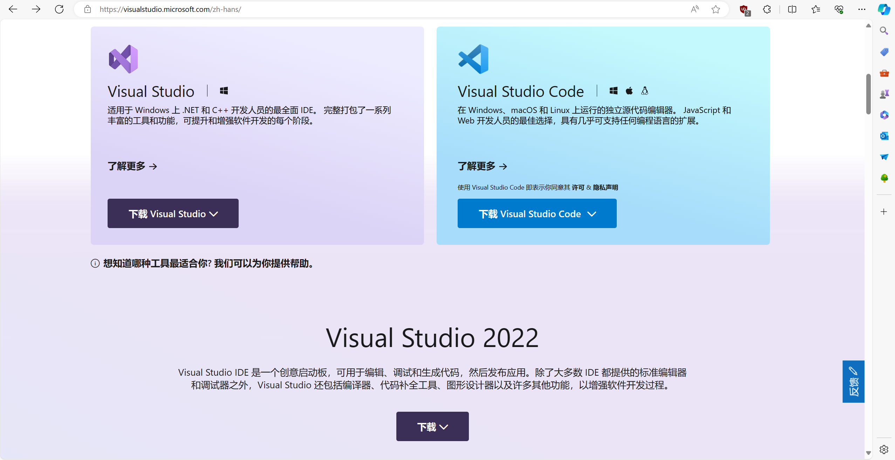
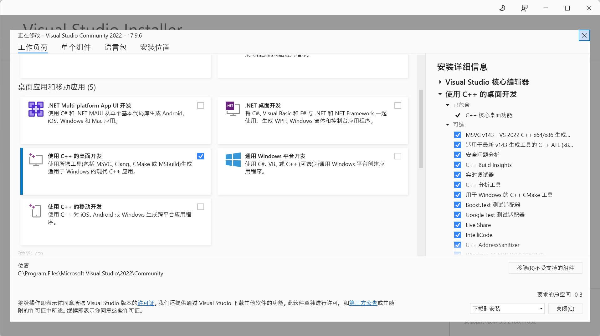

# 第一章 开发环境搭建

这里的环境搭建我只推荐两种：Visual Studio 和 Visual Studio Code + WSL

前者visual studio是宇宙第一IDE[^1]，后者vscode是一个很好的带有GUI界面[^2]的编辑器，WSL(Windows Subsystem for Linux)是一个在Windows下使用Linux发行版较为方便的使用方式了。后续我会提到这些都是什么。

## 安装Visual Studio

安装Visual Studio还是很简单的，就是等待时间也许会稍长一些。

在[Visual Studio官网](https://visualstudio.microsoft.com/zh-hans/)下载安装程序，这里推荐下载Community版本，可以免费使用。



下载好之后运行程序



对于学习C/C++来说，只需要点击**使用C++的桌面开发**即可

之后就是等待安装了，安装结束也就可以了

## 安装Visual Studio Code

### 安装WSL

Windows目前官方支持以下这些发行版:

```shell
wsl --list --online
以下是可安装的有效分发的列表。
使用 'wsl.exe --install <Distro>' 安装。

NAME                                   FRIENDLY NAME
Ubuntu                                 Ubuntu
Debian                                 Debian GNU/Linux
kali-linux                             Kali Linux Rolling
Ubuntu-18.04                           Ubuntu 18.04 LTS
Ubuntu-20.04                           Ubuntu 20.04 LTS
Ubuntu-22.04                           Ubuntu 22.04 LTS
Ubuntu-24.04                           Ubuntu 24.04 LTS
OracleLinux_7_9                        Oracle Linux 7.9
OracleLinux_8_7                        Oracle Linux 8.7
OracleLinux_9_1                        Oracle Linux 9.1
openSUSE-Leap-15.5                     openSUSE Leap 15.5
SUSE-Linux-Enterprise-Server-15-SP4    SUSE Linux Enterprise Server 15 SP4
SUSE-Linux-Enterprise-15-SP5           SUSE Linux Enterprise 15 SP5
openSUSE-Tumbleweed                    openSUSE Tumbleweed
```

[^1]: IDE, 集成开发环境。辅助程序开发者完成程序开发的全部工作，从源代码的编写，到编译执行以及调试，有的会支持插件，会提供更多的功能

[^2]: 这里特地说一遍GUI，是因为我不想引入vim/neovim等，如果你不知道vim/neovim，我在后面也是会简单提到的