# 第一章 开发环境搭建

这里的环境搭建我只推荐两种：Visual Studio 和 Visual Studio Code + WSL

前者visual studio是宇宙第一IDE[^1]，后者vscode是一个很好的带有GUI界面[^2]的编辑器，WSL(Windows Subsystem for Linux)是一个在Windows下使用Linux发行版较为方便的使用方式了。后续我会提到这些都是什么。

## 安装Visual Studio

安装Visual Studio还是很简单的，就是等待时间也许会稍长一些。

在[Visual Studio官网](https://visualstudio.microsoft.com/zh-hans/)下载安装程序，这里推荐下载Community版本，可以免费使用。

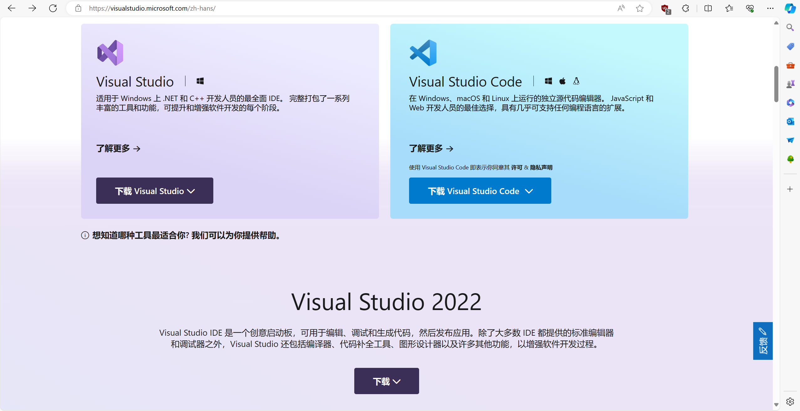

下载好之后运行程序


对于学习C/C++来说，只需要点击**使用C++的桌面开发**即可

之后就是等待安装了，安装结束也就可以了

### 使用Visual Studio

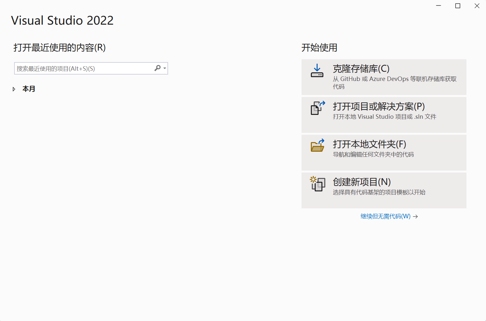

这里直接**创建新项目**就好了

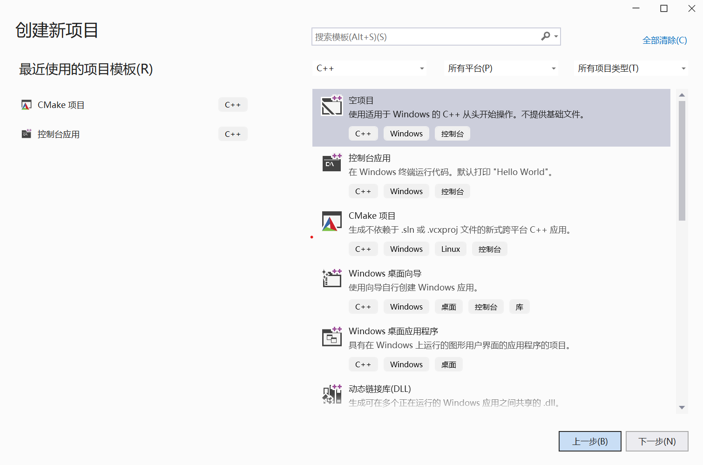

这里选择空项目即可

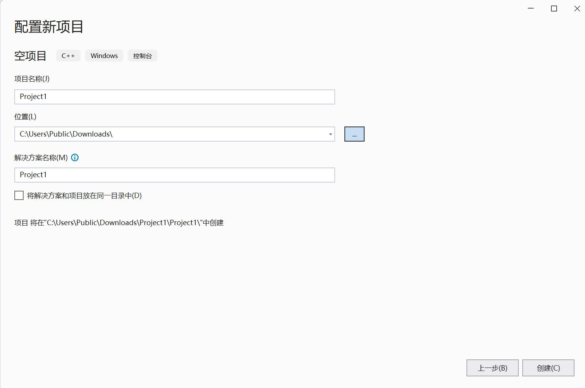

这里根据你的需求填写即可

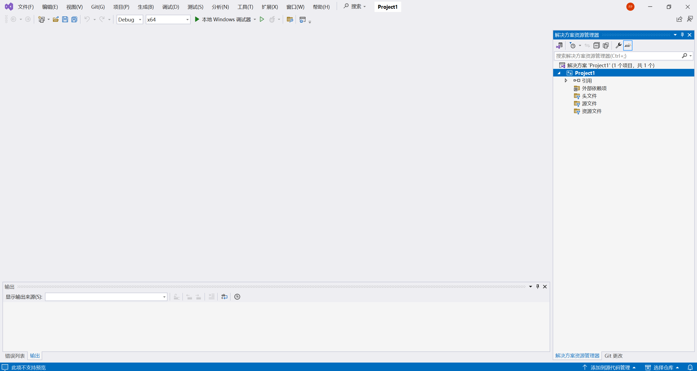

因为选择的是空项目，也就不包含什么文件了，这里可以在源文件右键添加一个源文件。

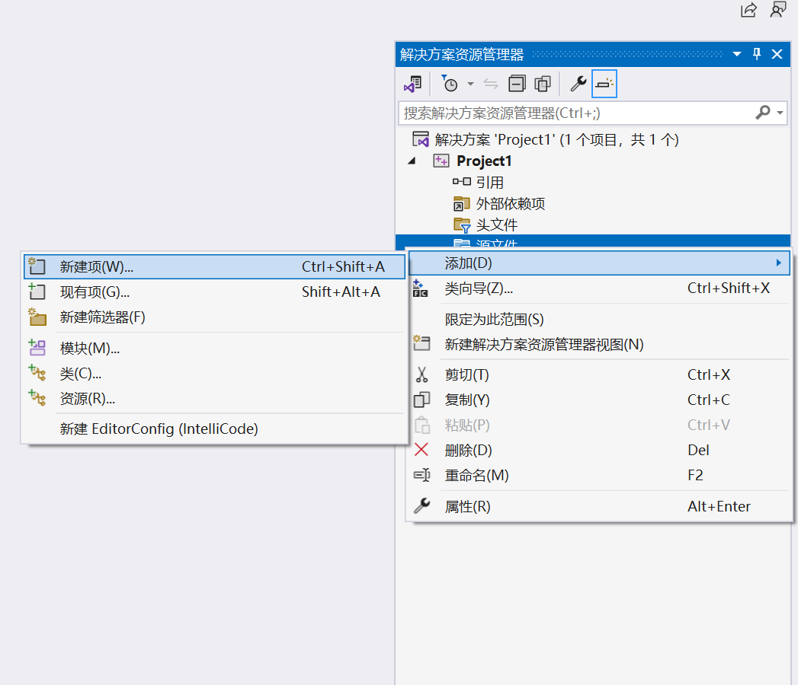

我这里输入的文件名称是main.c，新建之后，解决方案资源管理器的左边的空白窗口就会出现*main.c*文件的编辑窗口了

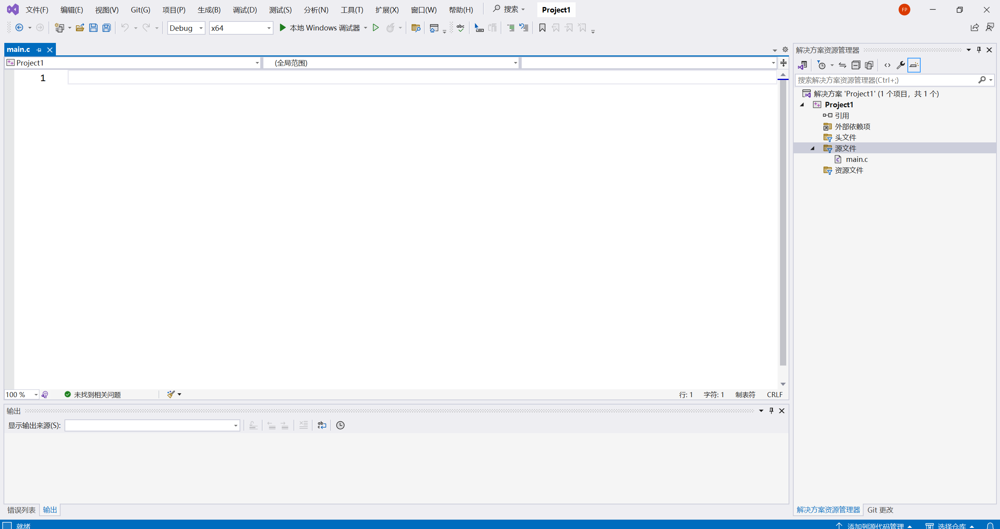

这里的代码提示补全默认是Tab键，像这样：


这里的小窗口的`#include`就是根据当前输入给出的补全结果，键入Tab之后就会应用这个补全。

这里我简单输入一段代码，这部分是介绍开发环境配置的，所以我先不解释代码。

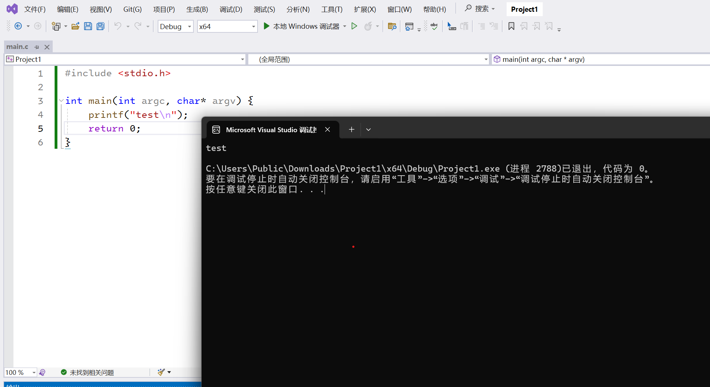

这里点击上方的**本地Windows调试器**即可运行该程序

左边的x64表示当前这段代码编译的软件最终要运行的机器的CPU架构，这里也就是x86-64了，一般还会提供一个x86的选项

我这里不详细介绍x86和x64的区别了（再一个本身我也不是清楚它们俩所有的区别）。x86最大可寻址内存限制为4GB，而x64则是16EB，并且新增了一些指令和寄存器等，x86-64比x86有更大的内存寻址空间，更好的性能与安全性。x86-64有时候被称为amd64（因为是AMD公司先提出的）。

再往左是一个Debug，Debug之外还有一个Release选项，分别对应着调试程序的阶段和对外发布的阶段。在Debug的时候会开启一些为了方便调试的编译选项，而Release时候也类似会开一些相关的编译选项。

## 安装Visual Studio Code

Microsoft提供的Visual Studio Code下载网页和Visual Studio是一个：[Visual Studio Code](https://visualstudio.microsoft.com/zh-hans/#vscode-section)


安装好之后可以下载一些插件先，我自己目前使用的插件大概是这些：

[Better C++ Syntax](https://marketplace.visualstudio.com/items?itemName=jeff-hykin.better-cpp-syntax), 为C++开启更全的语法高亮

[Chinese (Simplified) (简体中文) Language Pack for Visual Studio Code](https://marketplace.visualstudio.com/items?itemName=MS-CEINTL.vscode-language-pack-zh-hans), 中文汉化插件

[Error Lens](https://marketplace.visualstudio.com/items?itemName=usernamehw.errorlens), 将报错信息直接显示在对应行上，无需看专门的错误输出窗口

[Material Icon Theme](https://marketplace.visualstudio.com/items?itemName=PKief.material-icon-theme), 改变项目文件的图标。

[WSL](https://marketplace.visualstudio.com/items?itemName=ms-vscode-remote.remote-wsl), 连接WSL用的。

[clangd](https://marketplace.visualstudio.com/items?itemName=llvm-vs-code-extensions.vscode-clangd), 连接clangd这个lsp(Language Server Protocol)，提供了代码补全，代码格式化，语法检查等功能。

[CodeLLDB](https://marketplace.visualstudio.com/items?itemName=vadimcn.vscode-lldb), 使用lldb调试器进行调试，lldb是llvm项目内的，和gdb调试器类似。这里为什么没有用单选择一个lldb的，因为gdb调试器被[C/C++](https://marketplace.visualstudio.com/items?itemName=ms-vscode.cpptools)支持，但这个插件和clangd有些冲突。

[CMake](https://marketplace.visualstudio.com/items?itemName=twxs.cmake), cmake插件, 提供了编写CMakeLists的时候的代码补全等功能

[CMake Tools](https://marketplace.visualstudio.com/items?itemName=ms-vscode.cmake-tools), cmake插件, 提供了更方便的运行cmake的方式。

[Python](https://marketplace.visualstudio.com/items?itemName=ms-python.python), 使用python开发的话还是安装一个，提供了运行调试等多种功能。

这里面有的无需在本机安装，比如clangd, CodeLLDB这些，因为我们是为了连WSL进行开发工作。

### 安装WSL

Windows目前官方支持以下这些发行版:

```shell
wsl --list --online
以下是可安装的有效分发的列表。
使用 'wsl.exe --install <Distro>' 安装。

NAME                                   FRIENDLY NAME
Ubuntu                                 Ubuntu
Debian                                 Debian GNU/Linux
kali-linux                             Kali Linux Rolling
Ubuntu-18.04                           Ubuntu 18.04 LTS
Ubuntu-20.04                           Ubuntu 20.04 LTS
Ubuntu-22.04                           Ubuntu 22.04 LTS
Ubuntu-24.04                           Ubuntu 24.04 LTS
OracleLinux_7_9                        Oracle Linux 7.9
OracleLinux_8_7                        Oracle Linux 8.7
OracleLinux_9_1                        Oracle Linux 9.1
openSUSE-Leap-15.5                     openSUSE Leap 15.5
SUSE-Linux-Enterprise-Server-15-SP4    SUSE Linux Enterprise Server 15 SP4
SUSE-Linux-Enterprise-15-SP5           SUSE Linux Enterprise 15 SP5
openSUSE-Tumbleweed                    openSUSE Tumbleweed
```

我更推荐安装**openSUSE-Tumbleweed**，因为openSUSE-Tumbleweed软件更新策略导致它的软件更新一些。这里直接打开Windows Terminal安装openSUSE-Tumbleweed即可。

[Windows Terminal](https://github.com/microsoft/terminal)是微软官方发布的终端程序。貌似Windows 11是内置的，Windows 10的话就打开powershell吧。

如果不知道什么是终端，请移步(还在完善)。

在Windows Terminal中输入

```powershell
wsl.exe --install openSUSE-Tumbleweed
```

之后就开始自动化下载安装了

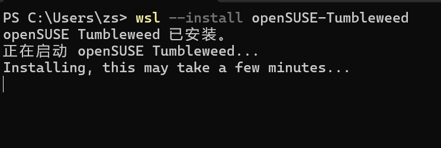

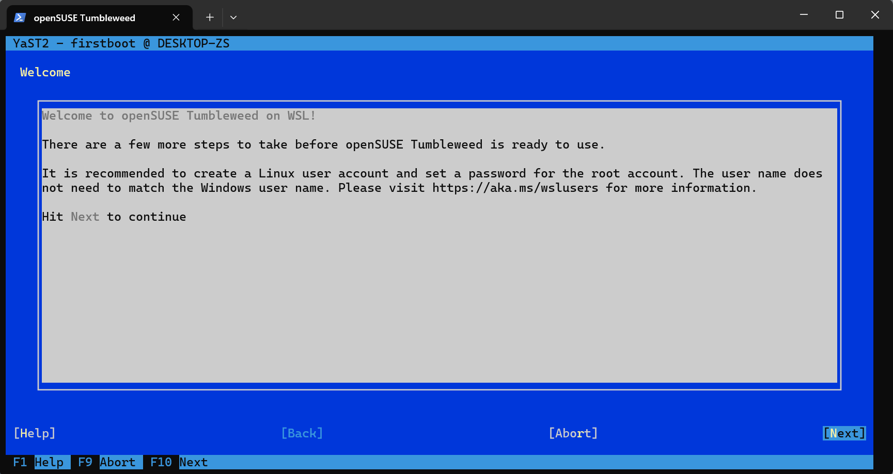

Tab和Shift + Tab键控制光标当前选中的选项，这里直接按回车就代表确认了。

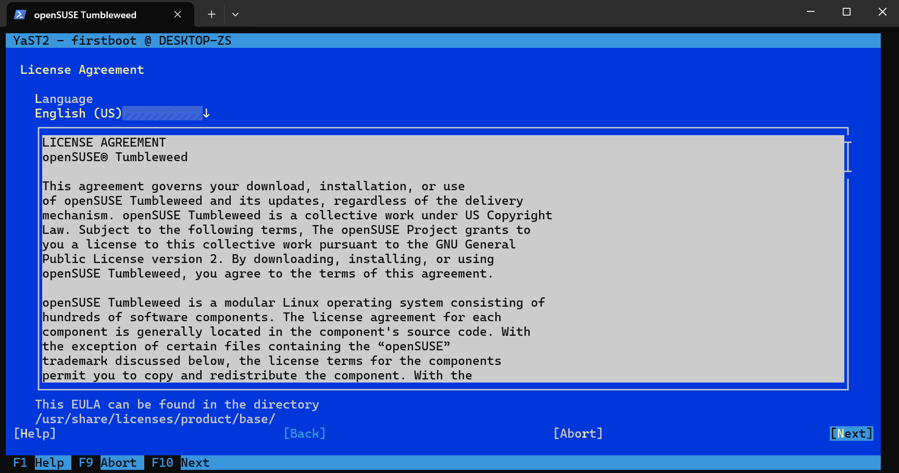

现在是让你选择语言，我推荐直接用默认的这个英文即可，因为我们主力机还是本机这个Windows，WSL安装只是方便工作，没必要上中文，当然还有就是一些软件的中文翻译没有那么健全，而且一些软件的报错信息什么的，英文更容易搜索一些。

**上面这段话，我无意于此论证中英文的优劣**，这里我只是局限于用来开发C/C++的WSL的安装时候的语言选择，不包含其它。

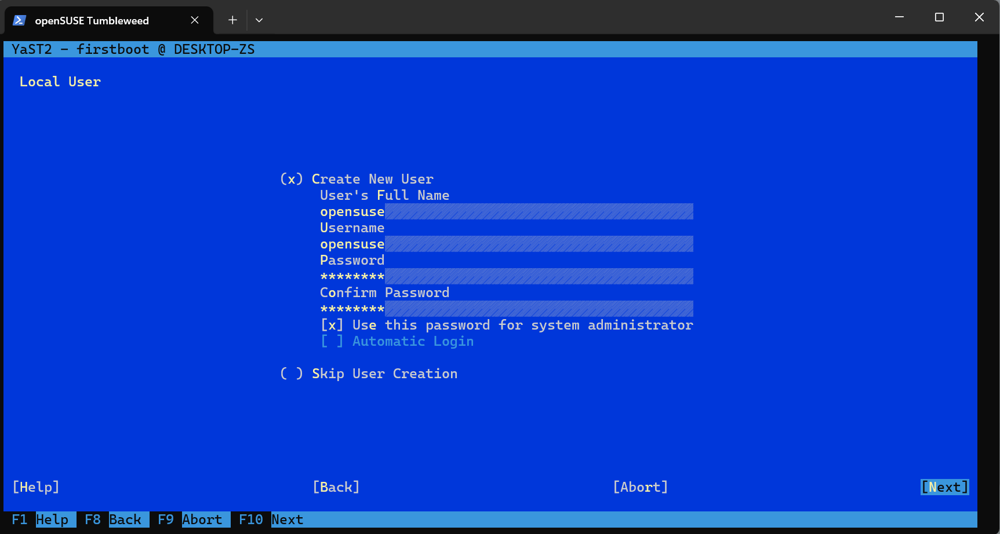

这里是在创建本地用户，如果你密码设置的太简单，它还会弹出一个询问是否要设置这么简单的密码的对话框，这里就不展示这个了。

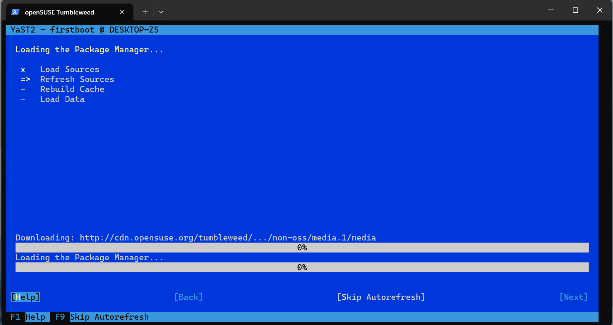

现在是在下载一些软件包(我猜测)，并且可以看到访问的域名是*cdn.opensuse.org*。

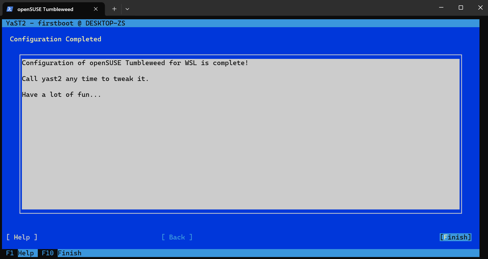

到这个页面就表明已经安装完了

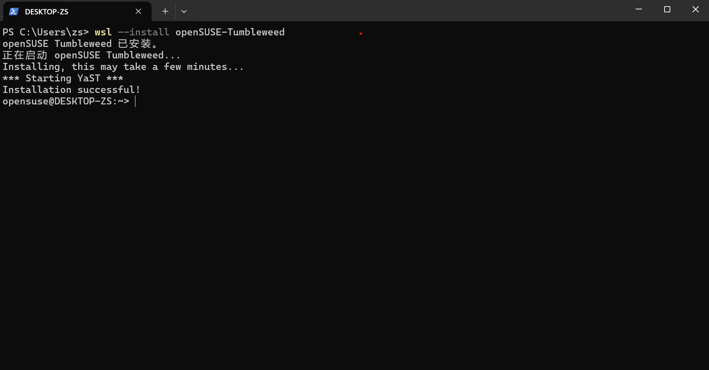

可以看到最后一行的前缀是**opensuse@DESKTOP-ZS**，现在就是在WSL内执行了。点击Windows Terminal上面新建标签栏右边那个按钮就可以找到这个opensuse的进入方式

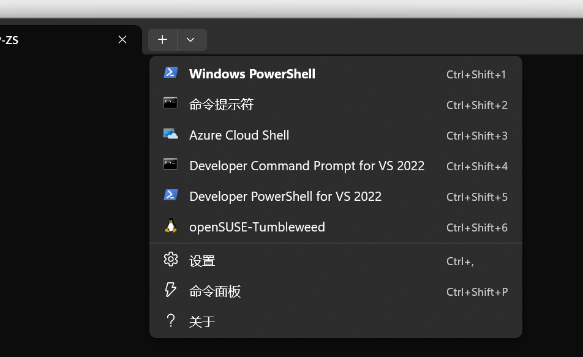

首先改root密码，注意这里是本机的powershell先执行`wsl --user root`以root用户身份登陆的WSL。

```bash
PS C:\Users\zs> wsl --user root
DESKTOP-ZS:/mnt/c/Users/zs # passwd root
New password:
Retype new password:
passwd: password updated successfully
```

值得注意的是，终端中输入密码基本是没有任何信息的，我的意思是你输入的字符不会变成\*，直接是不可见的。

这里先设置root密码是因为后续`sudo zypper`会询问root密码而非opensuse这个用户的密码。

之所以这里这么提到root，因为root是最高权限的用户。

```bash
opensuse@DESKTOP-ZS:~> sudo zypper install clang18 lldb starship cmake bash-completion gdb
```

我简单解释一下这条语句是干什么的

- sudo
    - 这是一个软件，sudo用来将后面的语句以高权限执行，而非当前用户权限。之前提到的root就是最高权限了，所以root身份执行后面的语句是没问题的，但为了安全起见，一般不推荐直接以root用户的身份运行程序。
- zypper install
    - 这是opensuse系统的软件包管理器，用来安装，更新，搜索，卸载软件包。还有其他功能，比如列出本地安装的软件包之类的。至于是怎么做到的，因为opensuse维护了一个官方的软件仓库。当然它也支持引入一些第三方软件仓库。
    - install 表明要使用zypper的安装功能
- clang18 lldb starship cmake bash-completion gdb
    - 这些都是软件包的名称，跟在**install**的后面表明是要安装的软件包的名称。
    - clang18
        - clang是用来编译C/C++代码的，其实clang还可以用来编译其他语言，但先不介绍了。这个clang18会安装18版本的clang，并且还有一些相关工具，比如clangd，clang-tidy，clang-format等实用工具
    - lldb
        - 软件调试器，属于LLVM项目
    - starship
        - 这是一个美化shell用的程序，你不知道shell是什么的话请访问 __(等待完善相关章节)。
    - cmake
        - C++项目的管理工具，用来完成项目的编译、运行、测试等工作，虽然有很多人批评cmake语法丑陋等缺点，但目前大多数开源项目都在使用cmake，也就这么用了。
    - bash-completion
        - 这是用来优化bash的补全功能的，如果你不理解这句话请访问 __(等待完善相关章节)。
    - gdb
        - 也是软件调试器，只不过是GNU项目的。

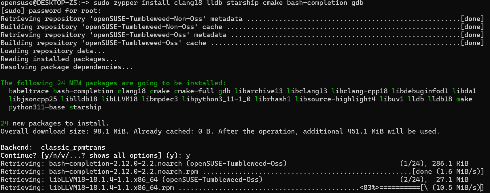

输入y确认安装，等待安装结束后，简单配置一下starship，输入`vim ~/.bashrc`

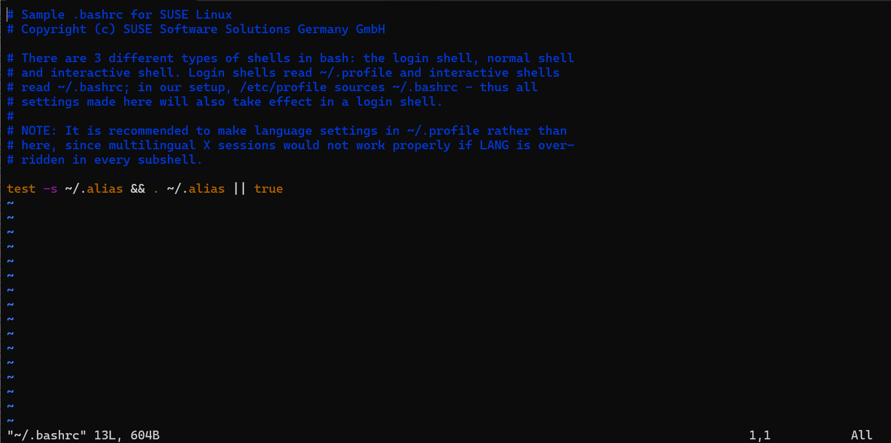

我这里先不过多介绍vim的用法了，就说这里能用到的，vim这个编辑器有四种模式——正常，命令，插入，观看（我的翻译可能有些问题）。

vim一打开就是命令模式，按`i`进入插入模式（按`a`也可以），按`v`就进入观看模式，按`:`进入命令模式，回到正常模式需要按`Esc`键。

不同模式下，左下角是显示是不同的，如果进入了插入模式的话，左下角的显示是：

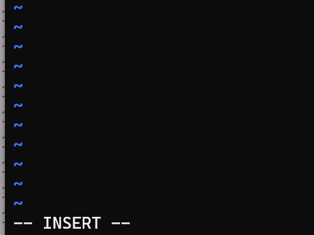

观看模式的话，INSERT的位置显示的是VISUAL。

根据[starship官网](https://starship.rs/zh-CN/guide/)，对于bash来说，需要在bashrc文件中添加`eval "$(starship init bash)"`，按`i`进入插入模式后，在文件末尾输入即可。

之后运行下面这条语句：

```bash
source ~/.bashrc
```

这表明加载 **~/.bashrc** 这个文件，否则无法立即生效，需要等到下次启动bash。

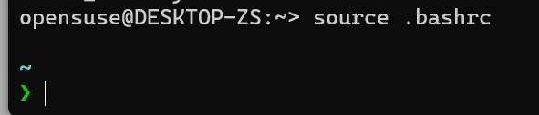

这就是starship美化后的样子，不只是彩色的输出，它其实还可以展示很多信息，只不过目前没有更多的配置，并且当前目录也没什么信息。

[^1]: IDE, 集成开发环境。辅助程序开发者完成程序开发的全部工作，从源代码的编写，到编译执行以及调试，有的会支持插件，会提供更多的功能

[^2]: 这里特地说一遍GUI，是因为我不想引入vim/neovim等，如果你不知道vim/neovim，我在后面也是会简单提到的