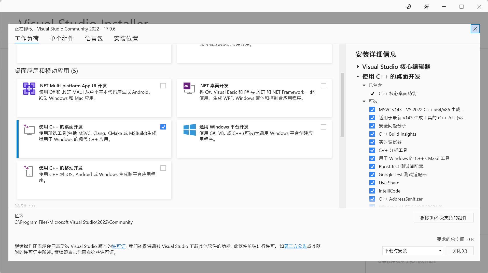
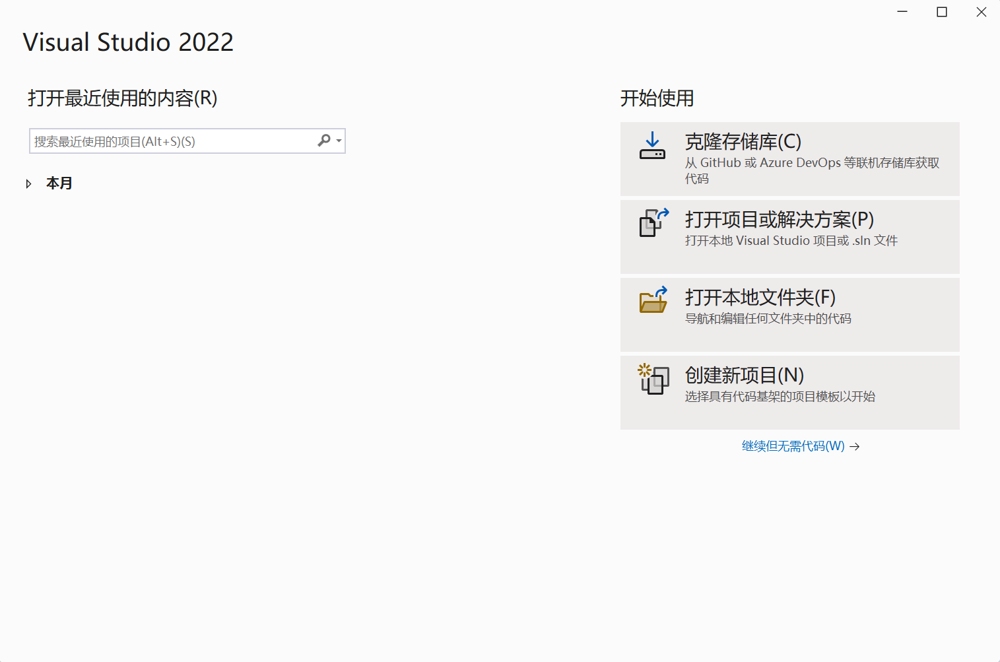
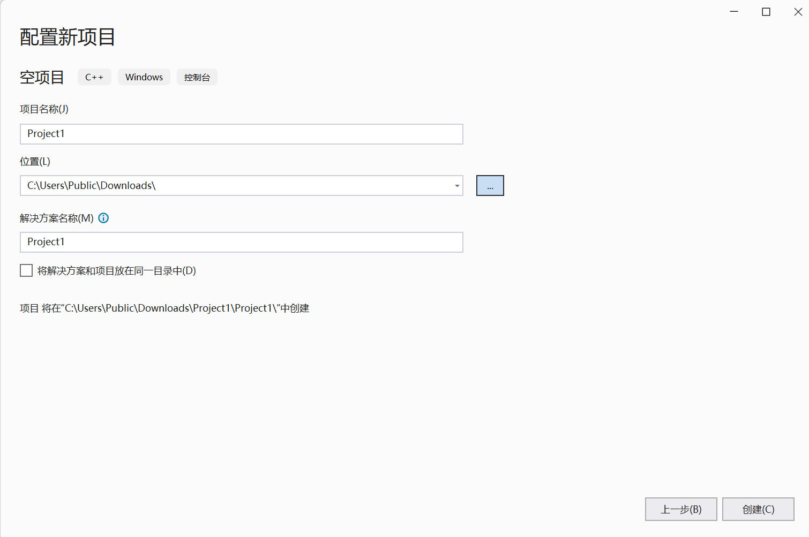
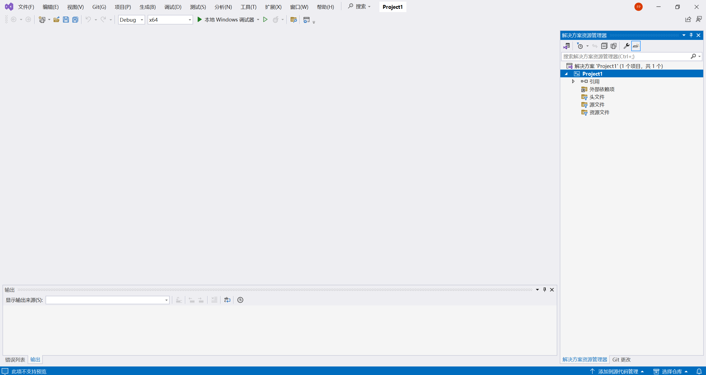
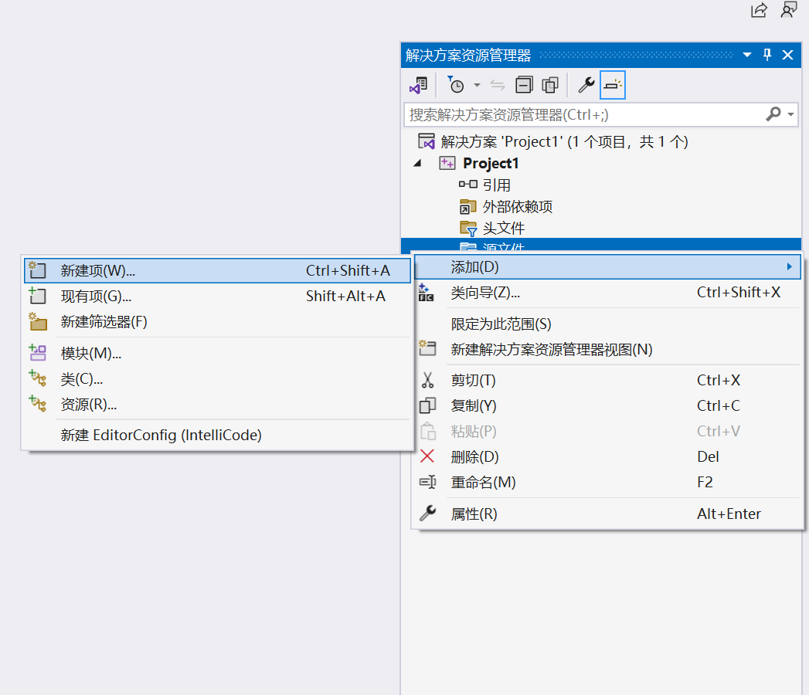
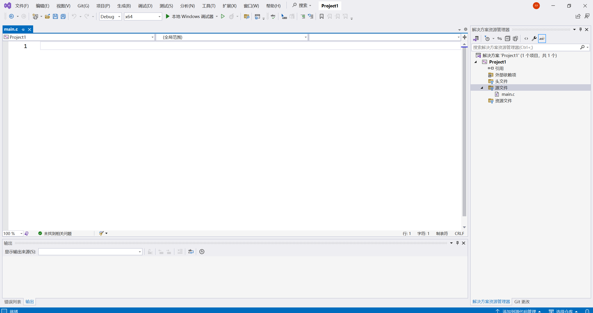
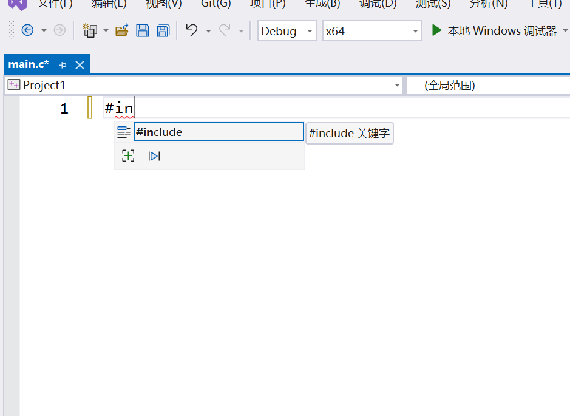
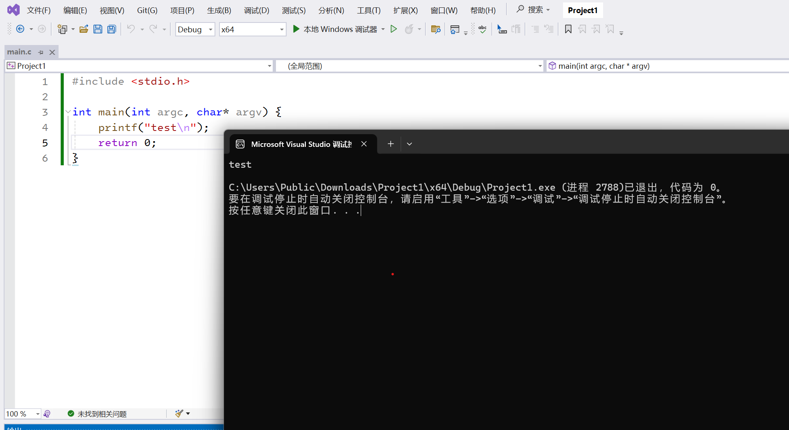

# 第一章 开发环境搭建

这里的环境搭建我只推荐两种：Visual Studio 和 Visual Studio Code + WSL

前者visual studio是宇宙第一IDE[^1]，后者vscode是一个很好的带有GUI界面[^2]的编辑器，WSL(Windows Subsystem for Linux)是一个在Windows下使用Linux发行版较为方便的使用方式了。后续我会提到这些都是什么。

## 安装Visual Studio

安装Visual Studio还是很简单的，就是等待时间也许会稍长一些。

在[Visual Studio官网](https://visualstudio.microsoft.com/zh-hans/)下载安装程序，这里推荐下载Community版本，可以免费使用。


下载好之后运行程序



对于学习C/C++来说，只需要点击**使用C++的桌面开发**即可

之后就是等待安装了，安装结束也就可以了

### 使用Visual Studio



这里直接**创建新项目**就好了


这里选择空项目即可



这里根据你的需求填写即可



因为选择的是空项目，也就不包含什么文件了，这里可以在源文件右键添加一个源文件。



我这里输入的文件名称是main.c，新建之后，解决方案资源管理器的左边的空白窗口就会出现*main.c*文件的编辑窗口了



这里的代码提示补全默认是Tab键，像这样：



这里的小窗口的`#include`就是根据当前输入给出的补全结果，键入Tab之后就会应用这个补全。

这里我简单输入一段代码，这部分是介绍开发环境配置的，所以我先不解释代码。



这里点击上方的**本地Windows调试器**即可运行该程序

左边的x64表示当前这段代码编译的软件最终要运行的机器的CPU架构，这里也就是x86-64了，一般还会提供一个x86的选项

我这里不详细介绍x86和x64的区别了（再一个本身我也不是清楚它们俩所有的区别）。x86最大可寻址内存限制为4GB，而x64则是16EB，并且新增了一些指令和寄存器等，x86-64比x86有更大的内存寻址空间，更好的性能与安全性。x86-64有时候被称为amd64（因为是AMD公司先提出的）。

再往左是一个Debug，Debug之外还有一个Release选项，分别对应着调试程序的阶段和对外发布的阶段。在Debug的时候会开启一些为了方便调试的编译选项，而Release时候也类似会开一些相关的编译选项。

## 安装Visual Studio Code

Microsoft提供的Visual Studio Code下载网页和Visual Studio是一个：[Visual Studio Code](https://visualstudio.microsoft.com/zh-hans/#vscode-section)


安装好之后可以下载一些插件先，我自己目前使用的插件大概是这些：

[Better C++ Syntax](https://marketplace.visualstudio.com/items?itemName=jeff-hykin.better-cpp-syntax), 为C++开启更全的语法高亮

[Chinese (Simplified) (简体中文) Language Pack for Visual Studio Code](https://marketplace.visualstudio.com/items?itemName=MS-CEINTL.vscode-language-pack-zh-hans), 中文汉化插件

[Error Lens](https://marketplace.visualstudio.com/items?itemName=usernamehw.errorlens), 将报错信息直接显示在对应行上，无需看专门的错误输出窗口

[Material Icon Theme](https://marketplace.visualstudio.com/items?itemName=PKief.material-icon-theme), 改变项目文件的图标。

[WSL](https://marketplace.visualstudio.com/items?itemName=ms-vscode-remote.remote-wsl), 连接WSL用的。

[clangd](https://marketplace.visualstudio.com/items?itemName=llvm-vs-code-extensions.vscode-clangd), 连接clangd这个lsp(Language Server Protocol)，提供了代码补全，语法检查等功能。

[CodeLLDB](https://marketplace.visualstudio.com/items?itemName=vadimcn.vscode-lldb), 使用lldb调试器进行调试，lldb是llvm项目内的，和gdb调试器类似。这里为什么没有用单选择一个lldb的，因为gdb调试器被[C/C++](https://marketplace.visualstudio.com/items?itemName=ms-vscode.cpptools)支持，但这个插件和clangd有些冲突。

[CMake](https://marketplace.visualstudio.com/items?itemName=twxs.cmake), cmake插件, 提供了编写CMakeLists的时候的代码补全等功能

[CMake Tools](https://marketplace.visualstudio.com/items?itemName=ms-vscode.cmake-tools), cmake插件, 提供了更方便的运行cmake的方式。

[Python](https://marketplace.visualstudio.com/items?itemName=ms-python.python), 使用python开发的话还是安装一个，提供了运行调试等多种功能。

这里面有的无需在本机安装，比如clangd, CodeLLDB这些，因为我们是为了连WSL进行开发工作。

### 安装WSL

Windows目前官方支持以下这些发行版:

```shell
wsl --list --online
以下是可安装的有效分发的列表。
使用 'wsl.exe --install <Distro>' 安装。

NAME                                   FRIENDLY NAME
Ubuntu                                 Ubuntu
Debian                                 Debian GNU/Linux
kali-linux                             Kali Linux Rolling
Ubuntu-18.04                           Ubuntu 18.04 LTS
Ubuntu-20.04                           Ubuntu 20.04 LTS
Ubuntu-22.04                           Ubuntu 22.04 LTS
Ubuntu-24.04                           Ubuntu 24.04 LTS
OracleLinux_7_9                        Oracle Linux 7.9
OracleLinux_8_7                        Oracle Linux 8.7
OracleLinux_9_1                        Oracle Linux 9.1
openSUSE-Leap-15.5                     openSUSE Leap 15.5
SUSE-Linux-Enterprise-Server-15-SP4    SUSE Linux Enterprise Server 15 SP4
SUSE-Linux-Enterprise-15-SP5           SUSE Linux Enterprise 15 SP5
openSUSE-Tumbleweed                    openSUSE Tumbleweed
```

我更推荐安装**openSUSE-Tumbleweed**，因为openSUSE-Tumbleweed软件更新策略导致它的软件更新一些。这里直接打开Windows Terminal安装openSUSE-Tumbleweed即可。

[Windows Terminal](https://github.com/microsoft/terminal)是微软官方发布的终端程序。貌似Windows 11是内置的，Windows 10的话就打开powershell吧。

如果不知道什么是终端，请移步(还在完善)。


[^1]: IDE, 集成开发环境。辅助程序开发者完成程序开发的全部工作，从源代码的编写，到编译执行以及调试，有的会支持插件，会提供更多的功能

[^2]: 这里特地说一遍GUI，是因为我不想引入vim/neovim等，如果你不知道vim/neovim，我在后面也是会简单提到的